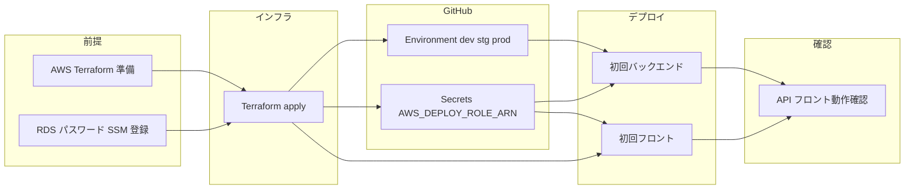

# hbp-cc-infra

hbp-cc アプリケーションの AWS インフラを Terraform で管理する **専用リポジトリ**。環境は **dev / stg / prod**。差異はサイズ（tfvars）のみ。

## リポジトリ構成

- **bootstrap/** — Terraform リモートステート用の S3 バケット・DynamoDB を一度だけ作成する。初回構築前に 1 回実行する（[bootstrap/README.md](bootstrap/README.md) 参照）。
- **envs/** — 環境ごとのルートモジュール
  - `envs/dev/`, `envs/stg/`, `envs/prod/` で `main.tf`・`variables.tf`・`terraform.tfvars` を配置
- **modules/** — 再利用モジュール（vpc, rds, elasticache, s3, cicd, alb, ecs, cloudfront, ses, terraform-runner-policy, acm, route53, batch, sqs, monitoring など）
- **scripts/** — 運用スクリプト（例: `assume-terraform-role.sh` で Terraform 実行用ロールを assume）
- **versions.tf** — Terraform および AWS provider のバージョン制約

## 前提

- **Terraform 1.x.x**（`required_version = "= 1.14.4"`）
- **AWS provider** `~> 5.0`
- AWS CLI 設定済み（または環境変数 `AWS_ACCESS_KEY_ID` / `AWS_SECRET_ACCESS_KEY`）

### Terraform ステート（S3）

各環境（dev / stg / prod）のステートは **S3 バックエンド** に保存する。バケット `hbp-cc-terraform-state` と DynamoDB テーブル `terraform-locks` でロックをかける。

**このプロダクト（hbp-cc）用**: bootstrap で作成する S3 バケット名・ステートキー（`hbp-cc-infra/<env>/terraform.tfstate`）は **このリポジトリ専用**。他プロダクトはそれぞれ自前のバケット／キーで同様の運用をする想定。DynamoDB テーブル `terraform-locks` は、LockID が「バケット名＋ステートキー」で決まるため、**同一テーブルを他プロダクトと共有しても問題ない**（プロダクトごとに別の LockID になり、ロックが衝突しない）。

**初回のみ**: このリポジトリで初めて Terraform を実行する前に、**ブートストラップ** を 1 回だけ行う。`bootstrap/` ディレクトリで `terraform init` → `terraform apply` を実行し、上記 S3 バケットと DynamoDB テーブルを作成する。手順は [bootstrap/README.md](bootstrap/README.md) を参照。完了後、`envs/<env>` で通常の plan / apply を実行する。

### Terraform の実行

**plan / apply の前に**、対象環境の RDS マスターパスワードを SSM Parameter Store に登録しておくこと（未登録だと `data "aws_ssm_parameter" "rds_password"` でエラーになる）。手順は後述の [RDS マスターパスワード（SSM のみ）](#rds-マスターパスワードssm-のみ) を参照。


**Makefile 利用時**（リポジトリルートで）:

```bash
make help                   # 利用可能なターゲット一覧
make plan                   # terraform plan
make apply                  # terraform apply（事前に apply-acm-cert を実行）
make plan ENV=stg           # stg 環境で plan
make output VAR=frontend_url  # 特定の output のみ取得
```

`make plan` は `init` のあと `terraform plan` のみ実行する（`-target` を使わないため警告が出ない）。`make apply` は `init` → `apply-acm-cert`（ACM 証明書のみ先に適用）→ `terraform apply` の順で実行する。カスタムドメイン使用時で初回 plan がエラーになる場合は、先に `make apply-acm-cert` を 1 回実行してから `make plan` する。

**よく使うターゲット**:

```bash
# --- セットアップ ---
make bootstrap              # リモートステート用 S3/DynamoDB を作成（初回のみ）
make assume                 # assume コマンドを表示（eval で実行）

# --- ターゲット指定 ---
make plan-target TARGET=module.ecs          # 特定モジュールのみ plan
make apply-target TARGET=module.ses[0]      # 特定モジュールのみ apply

# --- 運用 ---
make ecs-exec               # SSM で ECS タスクにログイン
make ecs-logs               # CloudWatch Logs を tail（直近 10 分）

# --- 確認 ---
make urls                   # フロントエンド・API の URL を表示
make deploy-role            # GitHub Actions 用デプロイロール ARN を表示
make cf-invalidate          # CloudFront キャッシュを全無効化
make ses-status             # 既存 SES ドメインの検証ステータスを表示
```

### GitHub Actions と OIDC

アプリリポジトリのデプロイ workflow は、**GitHub Environment 名が Terraform の env（dev / stg / prod）と一致している必要があります**。リポジトリの Settings → Environments で **dev** / **stg** / **prod** の 3 つを作成し、各 Environment の Secrets に **`AWS_DEPLOY_ROLE_ARN`** のみ登録してください。CloudFront のキャッシュ無効化用の Distribution ID は、workflow 内で環境名（`hbp-cc-<env> frontend` の Comment）から自動取得するため、別途登録は不要です。ブランチ名は development / staging / production のままでよく、workflow 内で dev / stg / prod にマッピングされます。

## 初回デプロイまでのフロー

フロント・バックエンドを初めてデプロイするときは、以下の順序で行う。GitHub Secrets（`AWS_DEPLOY_ROLE_ARN`）は Terraform apply 後の output が必要。フロントのデプロイは SSM の `api-base-url`（Terraform 作成）に依存する。



### 前提条件

- Terraform 1.14.4、AWS CLI 設定済み（上記「前提」参照）
- **ブートストラップ済み**（初回のみ [bootstrap/README.md](bootstrap/README.md) の手順で S3 バケット・DynamoDB を作成済み）
- 対象環境の RDS マスターパスワードを SSM に登録済み（[RDS マスターパスワード（SSM のみ）](#rds-マスターパスワードssm-のみ) 参照）
- （任意）Terraform 実行用ロールを assume する場合は [assume の手順](#terraform-実行用ロール案-a-assume-運用) 参照

### Step 0: ブートストラップ（初回のみ）

**このプロダクト用**のリソースを作る。まだ S3 バケット `hbp-cc-terraform-state` と DynamoDB テーブル `terraform-locks` をこのリポジトリ用に用意していない場合のみ実行する（他プロダクトと DynamoDB を共有している場合は、バケットが無いときだけ作成すればよい）。

**Makefile 利用**（リポジトリルートで）:

```bash
make bootstrap
```

### Step 1: インフラの構築（Terraform）

対象環境（例: dev）で次を実行する。

**Makefile 利用**（リポジトリルートで、init と ACM 証明書は自動で実行される）:

```bash
make plan
make apply
```

**作成される主なリソース**: VPC, RDS, ElastiCache, S3（アプリ用・フロント用）, ECR（API 用）, ALB, ECS クラスタ・タスク定義・サービス（Rolling デプロイ）, CloudFront（同一ドメイン: フロント＋`/api` を 1 本で HTTPS 配信）, SSM パラメータ（`/hbp-cc/<env>/api-base-url` は同一ドメインの `https://app-<env>.<domain>/api`・`/hbp-cc/<env>/service-url`）, GitHub Actions 用 IAM ロール（OIDC）。

**重要**: apply 後にデプロイ用ロール ARN を取得し、Step 2 で GitHub に登録する。

```bash
make deploy-role            # Makefile 利用
# または
cd envs/dev && terraform output github_actions_deploy_role_arn
```

### Step 2: GitHub の設定

- **Environments**: アプリリポジトリの Settings → Environments で **dev** / **stg** / **prod** の 3 つを作成する。名前は必ず dev / stg / prod（OIDC の `environment:` と一致させる）。
- **Secrets**: 各 Environment の Secrets に **`AWS_DEPLOY_ROLE_ARN`** を 1 つだけ登録する。値は Step 1 の `terraform output github_actions_deploy_role_arn` の出力。
- CloudFront の Distribution ID は workflow 内で Comment（`hbp-cc-<env> frontend`）から自動取得するため、Secrets には登録不要。

### Step 3: 初回バックエンドデプロイ

**トリガー**

- **push**: `development` / `staging` / `production` のいずれかへ `server/**` の変更を push する。
- **手動**: Actions → "Deploy Backend" → "Run workflow" で対象（development / staging / production）を選択する。「Use workflow from」のブランチは選択した環境と一致させること（workflow の Validate でチェックされる）。

**処理の流れ**: ECR ログイン → API イメージをビルド（`server/fastapi/Dockerfile`）→ ECR へ push（`hbp-cc-<env>-api`）→ **ECS ワンショットタスクで `alembic upgrade head` を実行（マイグレーション）** → 既存 ECS タスク定義を取得して新イメージで新リビジョン登録 → ECS サービスを新タスク定義で更新（Rolling デプロイ）。

### Step 3 のあと（任意）: 初回 DB シード（make seed）

dev などで開発用データ（組織・ユーザー・患者・管理者）を投入したい場合は、**SSM で ECS にログイン**し、コンテナ内で `make seed` を実行する。API イメージには `_bin/seed.py` および `_bin/seed_data/` が含まれている。

1. [SSM で ECS にログイン（ECS Exec）](#ssm-で-ecs-にログインecs-exec) の手順でコンテナに入る。
2. コンテナ内で以下を実行する。

```bash
make seed
```

- 組織・ユーザー・患者・管理者が投入される。
- **初期ログインユーザ**: メール `user@momo.com` / パスワード `Password12`

終了したら `exit` でシェルを抜ける。

### Step 4: 初回フロントエンドデプロイ

**トリガー**

- **push**: `development` / `staging` / `production` のいずれかへ `front/**` の変更を push する。
- **手動**: Actions → "Deploy Frontend" → "Run workflow" で対象を選択する。ブランチと環境の一致が必要。

**処理の流れ**: `AWS_DEPLOY_ROLE_ARN` で OIDC 認証 → Node セットアップ・`npm ci` → SSM から `/hbp-cc/<env>/api-base-url` を取得し `front/scripts/set-api-base-url.js` で環境ファイル（`environment.dev.ts` 等）の `apiBaseUrl` を上書き → `build:dev` / `build:stg` / `build:prod` でビルド → `front/dist/front/browser/` を S3 `hbp-cc-<env>-frontend` に sync → CloudFront キャッシュ無効化（Comment `hbp-cc-<env> frontend` で Distribution を検索）。

**依存**: Terraform が SSM に `api-base-url` を登録しているため、Step 1 が完了していることが前提。

### Step 5: 動作確認

- **URL 確認**: `make urls` でフロントエンド・API の URL を表示できる。フロントはルート、API は `/api`（例: `https://app-dev.example.com/` と `https://app-dev.example.com/api`）。
- ブラウザで frontend_url にアクセスし、API は同一オリジンで `/api` に発信される。
- 問題がある場合は `make ecs-logs` で CloudWatch Logs を tail するか、ECS のタスク状態を確認する。

### 補足

- **ブランチと env の対応**: development → dev, staging → stg, production → prod（workflow 内でマッピング）。
- **2 回目以降**: 上記 Step 3 / Step 4 のトリガー（push または手動）で同じ workflow を実行するだけ。

## Terraform 実行に必要な IAM 権限

`terraform apply` を実行する IAM ユーザー／ロールには、本リポジトリが作成・参照するリソースに対応した権限が必要です。

### 必要な権限の概要

本リポジトリの Terraform が扱う AWS サービスと、必要な権限の種類は以下のとおりです。

| サービス | 用途 | 主な権限の種類 |
|----------|------|----------------|
| **EC2** | VPC・サブネット・インターネットゲートウェイ・NAT ゲートウェイ・ルートテーブル・セキュリティグループ・EIP | Create*, Describe*, Delete*, Modify*, Associate*, Attach*, AllocateAddress など |
| **RDS** | DB サブネットグループ・DB インスタンス | CreateDBSubnetGroup, CreateDBInstance, Describe*, Delete*, Modify* など |
| **ElastiCache** | キャッシュサブネットグループ・Redis クラスタ | CreateCacheSubnetGroup, CreateCacheCluster, Describe*, Delete*, Modify* など |
| **S3** | アプリ用・フロントエンド用バケット（バージョニング・暗号化・パブリックアクセスブロック・バケットポリシー） | CreateBucket, PutBucket*, GetBucket*, DeleteBucket など |
| **IAM** | GitHub OIDC プロバイダ・デプロイ用ロール・ECS タスク実行ロール・タスクロール・ポリシー | CreateOpenIDConnectProvider, CreateRole, CreatePolicy, PutRolePolicy, AttachRolePolicy, GetRole, GetPolicy など |
| **ECR** | API・Worker 用リポジトリ | CreateRepository, PutLifecyclePolicy, GetAuthorizationToken など |
| **Elastic Load Balancing** | ALB・ターゲットグループ・リスナー・リスナールール | CreateLoadBalancer, CreateTargetGroup, CreateListener, CreateRule, Describe*, Delete*, Modify* など |
| **ECS** | クラスタ・タスク定義・サービス | CreateCluster, RegisterTaskDefinition, CreateService, Describe*, Update*, Delete* など |
| **CloudWatch Logs** | ECS API 用ロググループ | CreateLogGroup, PutRetentionPolicy, DescribeLogGroups, DeleteLogGroup など |
| **CloudFront** | 配信・Origin Access Control | CreateDistribution, CreateOriginAccessControl, Get*, Update*, Delete* など |
| **SSM Parameter Store** | RDS パスワードの参照（data）・api-base-url / service-url の作成 | GetParameter, PutParameter, DeleteParameter, AddTagsToResource（詳細は下記） |
| **SES** | ドメイン・メール identity（SES モジュール有効時） | VerifyDomainIdentity, VerifyEmailIdentity, GetIdentityVerificationAttributes など |
| **STS** | 呼び出し元 identity の取得（data） | GetCallerIdentity |


### Terraform 実行用ロール（assume 運用）

ARN 制限付きのポリシーと **Terraform 実行用ロール** は [modules/terraform-runner-policy](modules/terraform-runner-policy) で定義されています。環境（dev / stg / prod）ごとに、その環境のリソースにのみ権限が限定されたロールが作成されます。

**Terraform 実行者が持つ権限（2 回目以降）**: **Terraform 実行用ロールを assume する権限だけ**にしてください（PowerUserAccess は付けない）。そうすることで、Terraform を実行するには必ず assume が必要になり、assume したときのみスコープ付きの権限が使われます。

- **初回のみ**: 管理者（PowerUserAccess + IAMFullAccessを持つ別の IAM ユーザー）が対象環境で `terraform apply` を実行し、ロールを作成する。各環境の `terraform.tfvars` で `terraform_runner_allow_assume_principal_arns` に、assume を許可する IAM ユーザーまたはロールの ARN のリストを設定する。
- **2 回目以降**: Terraform を実行する人は、**assume 用スクリプト**で一時クレデンシャルを取得してから `terraform plan` / `apply` を実行する。

**assume の手順**（リポジトリルートで実行）:

```bash
# assume コマンドを表示（コピペ用）
make assume
# → eval $(./scripts/assume-terraform-role.sh dev)

# dev 用ロールを assume し、現在のシェルに環境変数をセット
eval $(./scripts/assume-terraform-role.sh dev)
make plan
```

stg / prod の場合は `make assume ENV=stg` や `dev` を `stg` / `prod` に置き換えてください。スクリプトには AWS CLI と jq（または Python 3）が必要です。ロールが未作成の場合はスクリプトがエラーで終了します。

**Terraform destroy 時の S3/ECR エラー対策**

`terraform destroy` で S3 の `BucketNotEmpty`（バージョン付きで中身が残っている）や ECR の `RepositoryNotEmptyException` が出る場合、先にバケット・リポジトリを空にしてから destroy する。

**`make destroy` で実行**（S3/ECR を空にしてから terraform destroy。リポジトリルートで）:

```bash
eval $(./scripts/assume-terraform-role.sh dev)
make destroy
# 別環境: make destroy ENV=stg
```

手動で空化のみ行う場合: `./scripts/empty-s3-and-ecr.sh dev`（`--bucket` / `--ecr` で対象絞り、`--dry-run` で対象のみ表示。要 jq）。

**Terraform 実行者に付与する assume 用ポリシー例**（PowerUserAccess の代わりにこのみ付与）:

```json
{
  "Version": "2012-10-17",
  "Statement": [
    {
      "Effect": "Allow",
      "Action": "sts:AssumeRole",
      "Resource": [
        "arn:aws:iam::YOUR_ACCOUNT_ID:role/hbp-cc-dev-terraform-runner",
        "arn:aws:iam::YOUR_ACCOUNT_ID:role/hbp-cc-stg-terraform-runner",
        "arn:aws:iam::YOUR_ACCOUNT_ID:role/hbp-cc-prod-terraform-runner"
      ]
    }
  ]
}
```

`YOUR_ACCOUNT_ID` を実際の AWS アカウント ID に置き換えてください。ロール ARN は各環境で `terraform output terraform_runner_role_arn` でも確認できます。

### SSM Parameter Store

`envs/dev/main.tf` で `/hbp-cc/<env>/api-base-url` と `/hbp-cc/<env>/service-url` を作成するため、**ssm:PutParameter**（および運用で Get/Delete する場合は GetParameter, DeleteParameter）が必要です。権限不足の場合は次のようなエラーになります。

```text
AccessDeniedException: User: arn:aws:iam::ACCOUNT:user/USERNAME is not authorized to perform: ssm:PutParameter on resource: arn:aws:ssm:REGION:ACCOUNT:parameter/hbp-cc/dev/...
```

### SSM で ECS にログイン（ECS Exec）

ECS サービスでは `enable_execute_command = true` により **ECS Exec**（SSM Session Manager）が有効です。実行中の API タスクにインタラクティブシェルで入りたいときに使います。

**前提**

- AWS CLI の Session Manager プラグインが入っていること（[インストール手順](https://docs.aws.amazon.com/systems-manager/latest/userguide/session-manager-working-with-install-plugin.html)）
- 利用する IAM ユーザー/ロールに **ecs:ExecuteCommand**, **ecs:DescribeTasks**, **ecs:ListTasks** および **ssmmessages** 系（CreateControlChannel, CreateDataChannel, OpenControlChannel, OpenDataChannel）の権限があること。Terraform 実行用ロール（`assume-terraform-role.sh`）にはこれらが含まれています。

**手順（例: dev）**

**Makefile で一括実行**（リポジトリルートで）:

```bash
# 事前に assume 推奨
eval $(./scripts/assume-terraform-role.sh dev)
make ecs-exec
# 別環境: make ecs-exec ENV=stg

# ログを確認したい場合（Ctrl+C で停止）
make ecs-logs
```

手動で実行する場合:

```bash
# 1. 対象環境の認証（Terraform ロールを assume する場合）
eval $(./scripts/assume-terraform-role.sh dev)

# 2. クラスタ名・サービス名を取得（任意。以下は dev の例）
cd envs/dev
CLUSTER=$(terraform output -raw ecs_cluster_name)   # 例: hbp-cc-dev-cluster
SERVICE=$(terraform output -raw ecs_service_name)   # 例: hbp-cc-dev-api

# 3. 実行中タスクの ID を 1 件取得
TASK_ARN=$(aws ecs list-tasks --cluster "$CLUSTER" --service-name "$SERVICE" --desired-status RUNNING --query 'taskArns[0]' --output text --region ap-northeast-1)
TASK_ID="${TASK_ARN##*/}"

# 4. コンテナへインタラクティブシェルで接続（コンテナ名は api）
aws ecs execute-command --cluster "$CLUSTER" --task "$TASK_ID" --container api --interactive --command "/bin/sh" --region ap-northeast-1
```

接続後はそのタスクのコンテナ内でシェル操作ができます。終了する場合は `exit` で抜けてください。

### RDS マスターパスワード（SSM のみ）

RDS のマスターパスワードは **SSM Parameter Store のみ**で参照します（`-var` での渡し方は廃止）。**環境ごと**にパスが決まります: `/hbp-cc/<env>/rds-master-password`（dev なら `/hbp-cc/dev/rds-master-password`、stg なら `/hbp-cc/stg/rds-master-password`）。別パスにしたいときだけ `db_password_ssm_parameter_name` を tfvars で指定する。

**初回のみ**: 対象環境の SSM に登録してから `terraform plan` / `apply` を実行する。

```bash
# dev の例
aws ssm put-parameter --name /hbp-cc/dev/rds-master-password --type SecureString --value 'あなたのパスワード' --region ap-northeast-1
```

パスワードは次の条件を満たすこと（満たさないと `Invalid master password`）。

- **長さ**: 8 文字以上 128 文字以下
- **使用不可文字**: 次の文字は含めないこと — `"`（ダブルクォート）, `` ` ``（バッククォート）, `\`, `@`, `/`, 半角スペース

英大文字・小文字・数字・記号（上記以外）を組み合わせた強めのパスワードを推奨します。

**本番（prod）での推奨**:

- **RDS**: `rds_deletion_protection = true` を tfvars で指定し、誤削除を防ぐ。
- **DB パスワードの渡し方**: ECS タスクには `db_password_secret_arn`（Secrets Manager の ARN）を渡し、`db_password_plain` は使わない。パスワードを Secrets Manager に登録し、その ARN を ECS モジュールの `db_password_secret_arn` に指定する。
- **JWT 等の秘密鍵**: `api_extra_environment` で平文を渡さず、SSM Parameter Store（SecureString）または Secrets Manager に格納し、ECS モジュールの `api_extra_secrets`（`{ name, valueFrom }` のリスト）と `api_extra_secret_arns`（タスク実行ロールに付与する ARN 一覧）で渡す。Terraform state に平文が残らない。

### SES（メール送信）

SES は **既存リソースを参照する方式**（Terraform 管理外）と、**Terraform で新規作成する方式**の 2 通りをサポートする。

#### 方式 1: 既存 SES の参照（推奨・現在の dev 設定）

AWS コンソールや別手段で作成済みの SES ドメイン identity を **Terraform で作成・更新・削除せず参照のみ** する。Terraform state に SES リソースが含まれないため、`terraform destroy` で SES が消える心配がない。

**設定方法**: 各環境の `terraform.tfvars` で以下を指定する。

```hcl
# 既存 SES（Terraform 管理外・参照のみ）
ses_existing_domain = "xxxxx.com"   # 検証済みドメイン
ses_existing_region = "us-west-2"      # SES のリージョン
```

- **変数**: `ses_existing_domain`（ドメイン名）と `ses_existing_region`（SES リージョン）
- Terraform は ARN（`arn:aws:ses:<region>:<account_id>:identity/<domain>`）を locals で構築し、ECS タスクロールに `ses:SendEmail` / `ses:SendRawEmail` 権限を付与する
- ECS タスクには環境変数 `AWS_SES_REGION` が自動設定される
- `ses_domain` / `ses_sender_email` が空（SES モジュール無効）の状態で使用する

**SES ステータスの確認**:

```bash
make ses-status              # 検証・DKIM・アカウント状態を表示
make ses-status ENV=stg      # stg 環境の SES を確認
```

#### 方式 2: Terraform で SES を新規作成

SES のドメイン identity やメールアドレス検証を Terraform で管理する場合。`ses_existing_domain` が空のときにフォールバックとして使われる。

**設定方法**: 各環境の `terraform.tfvars` で以下のいずれかを指定する。

```hcl
ses_domain       = "example.com"            # ドメイン identity を作成
ses_sender_email = "noreply@example.com"    # メールアドレス identity を作成
```

- **変数**: `ses_domain` / `ses_sender_email`。どちらかが空でないときのみ SES モジュール（`modules/ses/`）が有効になる
- dev は SES サンドボックスのため、送信できるのは **検証済みの送信元アドレス** のみ

**SES だけデプロイする場合**:

```bash
make apply-target TARGET=module.ses[0]
# または手動: cd envs/dev && terraform apply -target=module.ses[0]
```

前提として、`/hbp-cc/dev/rds-master-password` が SSM に登録済みであること（plan 時にデータソースが参照するため）。SES モジュールは他モジュールに依存しないため、この target だけで作成できる。
