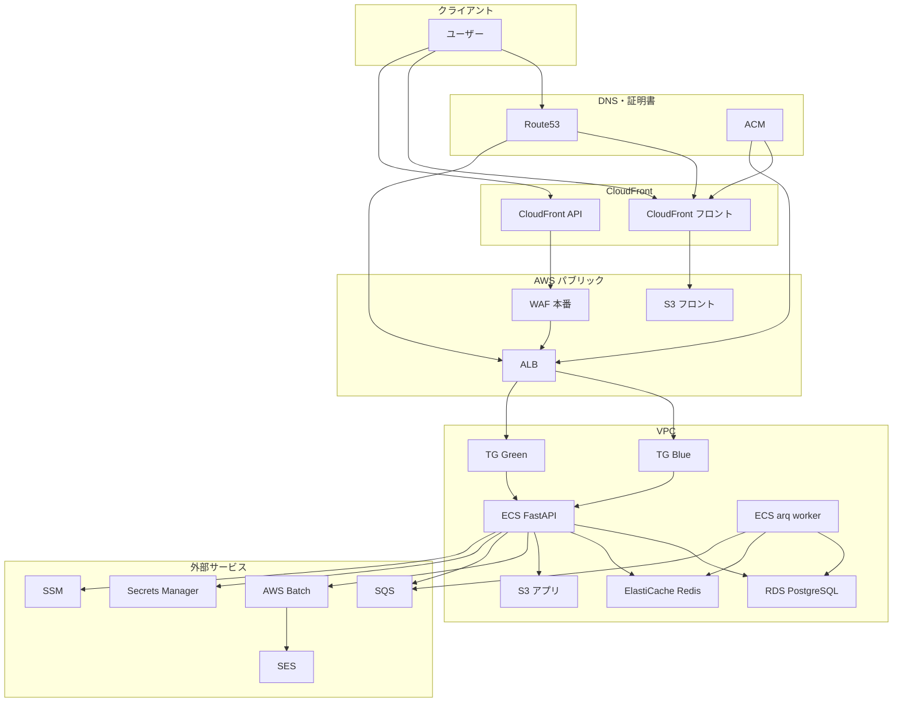
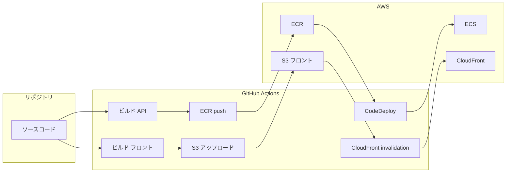
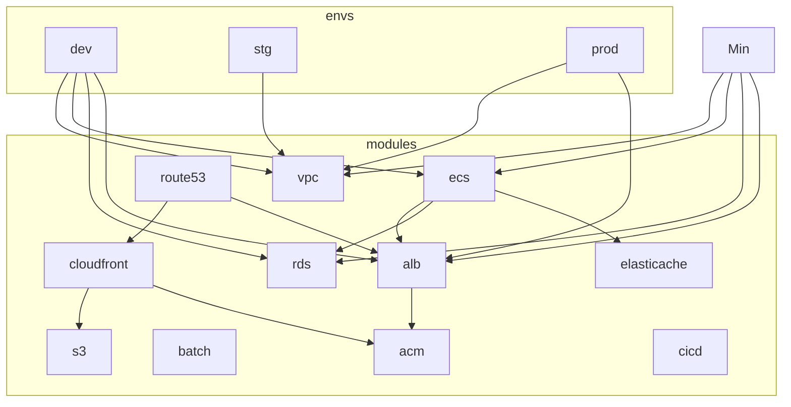

# hbp-cc 向け Terraform インフラ構成管理プラン

## ゼロからのセットアップ（Terraform 未導入・AWS 未設定の場合）

まっさらなマシンから本プランの Terraform を動かすまでに、以下を順に実施する。

### 1. Terraform のインストール

- **必要バージョン**: 本リポジトリは `required_version = ">= 1.5.0"` を想定。`~> 5.0` の AWS プロバイダを使う。
- **インストール例**:
  - **Linux（WSL2 含む）**: [HashiCorp 公式](https://developer.hashicorp.com/terraform/install) の手順に従う。または `tfenv` でバージョン管理する場合:
    ```bash
    # tfenv の場合（任意）
    git clone https://github.com/tfutils/tfenv.git ~/.tfenv
    echo 'export PATH="$HOME/.tfenv/bin:$PATH"' >> ~/.bashrc
    source ~/.bashrc
    tfenv install 1.5.0
    tfenv use 1.5.0
    ```
  - **macOS**: `brew install terraform` または上記 tfenv。
  - **Windows**: [公式インストーラ](https://developer.hashicorp.com/terraform/downloads) または Chocolatey `choco install terraform`。
- **確認**:
  ```bash
  terraform version
  # Terraform v1.5.0 以上であること
  ```

### 2. AWS CLI のインストール（推奨）

Terraform の AWS プロバイダは認証情報を必要とする。`aws configure` で設定する場合は AWS CLI が必要。

- **Linux（WSL2 含む）**:
  ```bash
  curl "https://awscli.amazonaws.com/awscli-exe-linux-x86_64.zip" -o "awscliv2.zip"
  unzip awscliv2.zip && sudo ./aws/install
  ```
- **macOS**: `brew install awscli`
- **確認**: `aws --version`

### 3. AWS の認証設定

- **方法 A: `aws configure`（対話式）**
  ```bash
  aws configure
  # AWS Access Key ID: （IAM ユーザーまたはロールのアクセスキー）
  # AWS Secret Access Key: （シークレットキー）
  # Default region name: ap-northeast-1
  # Default output format: （空 Enter または json）
  ```
- **方法 B: 環境変数**
  ```bash
  export AWS_ACCESS_KEY_ID="your-access-key-id"
  export AWS_SECRET_ACCESS_KEY="your-secret-access-key"
  export AWS_DEFAULT_REGION="ap-northeast-1"
  ```
- **動作確認**:
  ```bash
  aws sts get-caller-identity
  # アカウント ID とユーザー/ロール ARN が表示されれば OK
  ```

※ アクセスキーは IAM で「Terraform 用」のユーザーまたはロールを作成し、必要な権限（VPC / EC2 / RDS / S3 / ECS 等の作成・更新・削除）を付与したものを利用する。本番運用では OIDC や一時クレデンシャルの利用を推奨。

### 4. リポジトリの準備と初回 init

- 本リポジトリ（hbp-cc-infra）を clone 済み、またはルートが `hbp-cc-infra` である前提。
- **対象環境**（例: dev）のディレクトリに移動して初期化する:
  ```bash
  cd hbp-cc-infra/envs/dev
  terraform init
  ```
  - 初回はプロバイダ（aws 等）がダウンロードされ、`.terraform.lock.hcl` が生成される。このロックファイルは **リポジトリにコミット**する（CI と同一バージョンにするため）。
- **計画の確認**（リソースはまだ作らない）:
  ```bash
  terraform plan
  ```

### 5. ここまでで揃っているとよいもの

| 項目 | 確認コマンド |
|------|----------------|
| Terraform >= 1.5.0 | `terraform version` |
| AWS 認証が効いている | `aws sts get-caller-identity` |
| 作業ディレクトリ | `envs/dev` または `envs/stg` 等で `terraform init` 済み |
| ロックファイル | `envs/dev/.terraform.lock.hcl` をコミット推奨 |


## 前提とスコープ

- **対象**: hbp-cc のみ（hbp-cc-agent は対象外）
- **配置**: hbp-cc リポジトリ内に `infra/` ディレクトリを新設し、Terraform をここに集約する。のちに別リポジトリ `hbp-cc-infra` に分離する場合は、当該ディレクトリを移すだけでよい
- **CI/CD**: **CI および CD は GitHub Actions で行う**。アプリの CI（Lint・テスト）は既存の [.github/workflows/ci.yml](.github/workflows/ci.yml) を継続利用。Terraform の plan/apply とアプリのデプロイ（ECR push → ECS 更新）も GitHub Actions のワークフローで実行する。
- **クラウド**: AWS（ap-northeast-1）。既存の [docker-compose.yml](server/docker-compose.yml) および [jobs/caller/aws_caller.py](server/fastapi/app/jobs/caller/aws_caller.py) が参照する ECS / Batch / S3 / SQS / CloudFront 等と整合させる
- **医療業界 SaaS**: 医療情報・個人情報を扱うため、本プランでは **医療情報システムの安全管理に関するガイドライン** および **個人情報保護** を踏まえた構成とする（暗号化、監査ログ、可用性、ネットワーク分離を後述セクションで明示する）。
- **環境の種類**: **dev** / **stg** / **prod** の 3 段階。**環境間の違いはサイズのみ**とする（後述）。**dev** は開発用のフルスタック環境（最小スペックで AWS に全てデプロイ）。構成（VPC エンドポイント、Batch、監査・暗号化の有無）は全環境で同一とし、`terraform.tfvars` で **インスタンスクラス・タスク数・vCPU/メモリ・ストレージ・AZ 数** だけを変える。

## アプリが想定する AWS リソース（現状の参照から）


| 用途        | ローカル (docker-compose) | 本番想定 (Terraform で管理)                                                                                                         |
| --------- | --------------------- | ---------------------------------------------------------------------------------------------------------------------------- |
| API / Web | fastapi               | ECS (Fargate)                                                                                                                |
| ワーカー      | (同一コンテナ内 or arq)      | ECS Task (arq worker)                                                                                                        |
| DB        | db (PostgreSQL 17)    | RDS (PostgreSQL 17)                                                                                                          |
| キャッシュ・キュー | redis                 | ElastiCache (Redis)                                                                                                          |
| オブジェクトストア | storage (MinIO)       | S3                                                                                                                           |
| CDN       | cdn (nginx)           | CloudFront                                                                                                                   |
| メール       | mail (MailHog)        | SES + SQS                                                                                                                    |
| 非同期ジョブ    | ローカル別プロセス             | **AWS Batch**（batch モジュールで job queue / job definition を定義。[aws_caller.py](server/fastapi/app/jobs/caller/aws_caller.py) が参照） |
| コンテナイメージ | —（ローカルビルド）           | **ECR**（cicd モジュールで API / worker / frontend 用リポジトリを環境ごとに作成。push 先として CD で利用）                             |
| デプロイ / CD | —                     | ECR push + GitHub Actions（CodeDeploy / S3+CloudFront）                                                                       |


---

## 構成図

### ランタイム構成（1 環境のイメージ）

ユーザーはドメイン（Route53・環境別サブドメイン）経由でアクセス。フロントは S3 + CloudFront、API は ALB 経由で ECS（ブルー/グリーン）に到達する。ECS は VPC 内で RDS / ElastiCache / S3 / Batch / SQS 等を利用する。




- **TG Blue / TG Green**: ブルー/グリーン用の 2 つのターゲットグループ。CodeDeploy がトラフィックを切り替える。
- **SSM**: ECS Exec（Session Manager）でタスクに入る際に利用。Secrets Manager / SSM は VPC エンドポイント経由でアクセス。

### CD パイプライン構成

バックエンドは ECR → CodeDeploy でブルー/グリーン。フロントは S3 アップロード → CloudFront 無効化。Terraform の apply は別ワークフローで環境ごとに実行。




- バックエンド: ビルド → ECR push → 新タスク定義 → CodeDeploy で green にデプロイ → 検証後にトラフィック切り替え。
- フロント: Angular ビルド → S3 アップロード → CloudFront キャッシュ無効化。

### Terraform 環境とモジュールの関係

環境（dev / stg / prod）は同じモジュールを呼び出し、`terraform.tfvars` のサイズとタグのみ変える。




- 各環境の `main.tf` が同じ `modules/*` を参照し、`terraform.tfvars` で `instance_class`・`task_count`・`az_count`・`tags` 等を環境ごとに設定する。

---

## ディレクトリ構成（案）

```
hbp-cc/infra/
├── README.md
├── .gitignore              # .terraform/, *.tfstate*, *.tfstate.*, *.tfvars（任意）。.terraform.lock.hcl は含めずコミットする
├── versions.tf             # required_version, required_providers（aws 等）のバージョン制約
├── backend.tf              # 環境ごとで上書きする想定（後述）
├── envs/
│   ├── dev/                # 開発用フルスタック（最小スペックで AWS に全デプロイ、構成は他環境と同じ）
│   │   ├── main.tf
│   │   ├── variables.tf
│   │   ├── outputs.tf
│   │   ├── terraform.tfvars
│   │   └── backend.tf
│   ├── dev/                # 標準的な開発環境
│   │   ├── main.tf         # dev 用の module 呼び出しと variable 紐付け
│   │   ├── variables.tf
│   │   ├── outputs.tf
│   │   ├── terraform.tfvars
│   │   └── backend.tf      # dev 用 S3 backend
│   ├── stg/
│   └── prod/
└── modules/
    ├── vpc/
    ├── ecs/                # FastAPI + arq worker 用
    ├── rds/
    ├── elasticache/
    ├── s3/
    ├── alb/                # ECS の前段
    ├── cloudfront/         # CDN（既存の CDN_DOMAIN と連携）
    ├── batch/              # AWS Batch（job queue, job definition）
    ├── ses/                # メール送信（SES ドメイン・送信設定）
    ├── sqs/                # メーラー用 SQS 等
    ├── route53/            # ドメイン・DNS（環境別サブドメイン分離）
    ├── acm/                # TLS 証明書（ALB / CloudFront 用）
    ├── monitoring/         # CloudWatch アラーム・SNS（想定外アクセス・障害の検知）
    └── cicd/               # CD 用（ECR、GitHub OIDC 用 IAM ロール 等）
    # 各モジュールには README.md を置き、用途・入力 variables・出力 outputs を記載する（Standard Module Structure）
```

- **モジュールのベストプラクティス**: 各モジュールは **単一の責務** にし、**variables（入力）と outputs（出力）の契約** を明確にする。HashiCorp の [Standard Module Structure](https://developer.hashicorp.com/terraform/language/modules/develop/structure) に従い、各モジュールに **README.md** を置き、用途・必須/任意の variables・outputs を記載する。
- ルートの `versions.tf` / `backend.tf` は共通のひな形とし、実際の `plan` / `apply` は `envs/<env>/` で行う想定（`-chdir=envs/dev` / `envs/stg` など）
- **versions.tf のベストプラクティス**: `terraform` ブロックで `**required_version**`（例: `>= 1.5.0`）を指定し、`**required_providers**` でプロバイダのバージョン制約（例: `aws = "~> 5.0"`）を明示する。`**.terraform.lock.hcl` は .gitignore に含めずリポジトリにコミット**し、CI とローカルで同じプロバイダ版が使われるようにする。
- 環境ごとに backend の S3 バケット・キーを分け、state の混在を防ぐ
- 環境間の違いは **サイズのみ**。各環境の `terraform.tfvars` で `instance_class`・`task_cpu`・`task_memory`・`task_count`・`storage_gb`・`az_count` 等を指定する（後述「環境ごとの違い（サイズのみ）」参照）
- **コスト・タグ付け**: 全リソースに `Environment`・`Project`・`CostCenter` 等のタグを Terraform で付与し、AWS コスト配分で環境別に集計できるようにする。各モジュールで共通の `tags` 変数を受け取り、`envs/<env>/terraform.tfvars` で設定する。

---

## リソースとモジュールの対応

各モジュールは 1 責務に限定し、呼び出し元（envs）には variables / outputs でだけ結合する。以下はモジュールごとの役割とインターフェースの要約である。

- **vpc**: VPC / パブリック・プライベートサブネット（アプリ・DB はプライベート）/ NAT / セキュリティグループ（最小権限）。本番では VPC エンドポイント（S3, ECR, Secrets Manager, SSM 等）を定義し、医療系 SaaS として通信経路を閉じる。
- **ecs**: ECS クラスタ、Fargate のタスク定義・サービス（FastAPI 用と arq worker 用）、実行ロール。プライベートサブネットに配置し、Secrets Manager / SSM からシークレットを注入。**SSM Session Manager** で ECS タスクに接続できるようにする（タスクロールに SSM 用ポリシーを付与し、ECS Exec を有効化）。**想定外のアクセス集中**に備え、FastAPI 用サービスに **Application Auto Scaling**（Target Tracking：ALB リクエスト数または CPU）を設定し、最小・最大タスク数を tfvars で指定する。
- **rds**: RDS PostgreSQL 17、ストレージ暗号化（KMS）有効、マルチ AZ、自動バックアップ・PITR を有効化。サブネットグループはプライベート、セキュリティグループは db 接続元（ECS 等）に限定。
- **elasticache**: ElastiCache Redis、in-transit および at-rest 暗号化有効、サブネットグループはプライベート、セキュリティグループは FastAPI / ECS からのみ。
- **s3**: アプリ用バケット（user-resources / hbp-next 等）。SSE（S3 または KMS）有効、バージョニング有効。バケットポリシーで必要最小限のアクセスのみ許可。
- **alb**: ALB、**ブルー/グリーン用に 2 つのターゲットグループ**、HTTPS リスナーのみ（TLS 1.2 以上）。ECS のブルー/グリーンでは CodeDeploy が 2 つのターゲットグループ間でトラフィックを切り替える。本番では WAF を ALB 前に配置する想定。
- **cloudfront**: **フロントエンド**は S3 をオリジンにした CloudFront で配信。API は ALB をオリジンとする別ディストリビューションまたは同一ディストリビューションの別オリジンでよい。既存の `AWS_CLOUDFRONT_HBP_*` と整合するキャッシュ設定。
- **batch**: **AWS Batch** — 重い処理や別プロセスで実行したいジョブ（メール一括送信、レポート生成など）を、ECS とは別の Fargate/EC2 で動かす AWS のマネージドサービス。Terraform では compute environment（Fargate 推奨）、job queue、job definition を定義し、[aws_caller.py](server/fastapi/app/jobs/caller/aws_caller.py) が参照する `jobQueue`（例: `{env}_default`）と `jobDefinition`（例: `{env}_fastapi_default_job`）の名前と合わせる。
- **ses**: メール送信用（SES のドメイン ID またはメールアドレス検証、送信制限の設定）。アプリの `AWS_SES_REGION` と連携
- **sqs**: メーラー用キュー（`AWS_SQS_MAILER_URL`）、必要に応じて LINE 用キュー
- **route53**: ドメイン・DNS を Terraform で管理。**ドメイン分離**として、環境ごとにサブドメインを分ける（例: `api-dev.xxx.jp`、`api-stg.xxx.jp`、`api.xxx.jp` または `api-prod.xxx.jp`）。各環境の ALB / CloudFront に A または CNAME で向ける。
- **acm**: ALB および CloudFront 用の TLS 証明書を Terraform で発行・検証（ACM）。Route53 で DNS 検証する想定。環境ごとのサブドメインに対応した証明書（ワイルドカードまたは環境別）。
- **monitoring**: 想定外のアクセス集中や障害を検知するため、CloudWatch アラーム（ALB 5xx、ECS CPU、RDS 接続数・CPU 等）と SNS トピック（通知先）を Terraform で定義する。各モジュールの出力（ALB ARN、ECS サービス名、RDS 識別子等）を参照してアラームを張る。
- **cicd**: **ECR**（API / worker / frontend 用リポジトリを環境ごとに作成。push 時イメージスキャン有効）、および GitHub OIDC 用 IAM ロール（後述）。デプロイ先として ECR を構成に含める。

---

## 医療業界 SaaS を踏まえた構成

医療情報・個人情報を扱う SaaS として、以下を Terraform で明示的に設定する。

- **暗号化**
  - **保存時**: RDS はストレージ暗号化（KMS）を有効化。S3 はバケット単位で SSE-S3 または SSE-KMS を有効化。ElastiCache は in-transit（TLS）と at-rest の暗号化を有効化。Secrets Manager / SSM はデフォルトで暗号化。
  - **通信時**: ALB は HTTPS のみ（TLS 1.2 以上）。ECS ↔ RDS / ElastiCache / S3 は VPC 内または VPC エンドポイント経由とし、必要に応じて TLS を利用。
- **監査・証跡**
  - **AWS 側**: CloudTrail を有効化し、管理イベントを S3 に保存（ログの改ざん防止のためオブジェクトロックや別アカウント格納を検討）。VPC Flow Logs でネットワーク挙動を記録。RDS の監査ログ（PostgreSQL のログ出力）を CloudWatch Logs へ送信する設定を検討。
  - **アプリ側**: 既存の [docs/audit_logs](docs/audit_logs) で定義されている監査ログはアプリケーションで記録される前提。インフラではその保存先（RDS / S3 / CloudWatch）の保持期間・アクセス制御を Terraform で定義する。
- **可用性・バックアップ**
  - **RDS**: マルチ AZ 配置、自動バックアップの保持期間（例: 35 日）、必要に応じて PITR（ポイントインタイムリカバリ）を有効化。
  - **S3**: バージョニングを有効化し、誤削除・上書きからの復旧を可能にする。ライフサイクルは要件に応じて設定。
  - **ECS**: 本番は複数 AZ にタスクを分散。ALB のヘルスチェックとデプロイ時のローリング更新でダウンタイムを最小化。
- **ネットワーク・アクセス制御**
  - **VPC**: アプリ・DB・キャッシュはプライベートサブネットに配置。パブリックサブネットは ALB / NAT 等に限定。セキュリティグループは最小権限（必要なポート・ソースのみ許可）。
  - **VPC エンドポイント**: 全環境で同一構成とする。S3 は Gateway、ECR / Secrets Manager / SSM は Interface エンドポイントで VPC 内完結させ、インターネット経由を減らす。
  - **WAF**: ALB の前に AWS WAF を配置し、SQL インジェクション・XSS 等の共通攻撃対策と、必要に応じてレート制限・IP 制限を検討。
- **運用・変更の監査**
  - Terraform の state は S3 のバージョニングと DynamoDB ロックで改ざん・同時変更を防止。本番への `apply` は GitHub Actions の履歴で誰がいつ実行したかを残す。
  - 本番環境の IAM は最小権限とし、必要に応じて MFA や条件付きアクセスを検討（Terraform で IAM ポリシーを定義）。
- **ドメイン・証明書（Terraform、ドメイン分離）**
  - **ドメインと DNS**: Route53 でホストゾーンを管理し、Terraform（`modules/route53`）でレコードを定義する。**ドメイン分離**として、環境ごとにサブドメインを分ける（例: `api-dev.example.jp`、`api-stg.example.jp`、`api.example.jp`）。フロント用も同様（例: `app-dev.example.jp`、`app.example.jp`）。
  - **証明書**: ACM で ALB および CloudFront 用の TLS 証明書を発行。Terraform（`modules/acm`）で証明書リソースと Route53 による DNS 検証を定義する。環境ごとのサブドメインに対応した証明書（ワイルドカード `*.example.jp` または環境別）を用意する。
- **コスト・タグ付け**
  - 全リソースに `Environment`（dev / stg / prod）、`Project`（例: hbp-cc）、`CostCenter` 等のタグを付与する。各モジュールで `tags` 変数を受け取り、`envs/<env>/terraform.tfvars` で共通タグを渡す。AWS コスト配分で環境別・プロジェクト別に集計できるようにする。
- **SSM Session Manager で ECS タスクに入る**
  - 本番・stg 等の ECS タスクにデバッグで入る場合は、踏み台（Bastion）は使わず **SSM Session Manager（ECS Exec）** を使う。Terraform で ECS タスク定義の実行ロールに `AmazonSSMManagedInstanceCore` 相当のポリシーを付与し、ECS サービスで `enable_execute_command = true` を設定する。VPC に SSM 用の VPC エンドポイント（ssmmessages, ec2messages, ssm）が既に含まれている前提。接続は `aws ecs execute-command` で行う。
- **想定外のアクセス集中への対応**
  - **ECS のオートスケール**: FastAPI 用 ECS サービスに **Application Auto Scaling** を設定する。Target Tracking で「ALB の 1 ターゲットあたりのリクエスト数」または「CPU 使用率」をターゲットにし、超過時にタスクを自動増加させる。最小・最大タスク数は `envs/<env>/terraform.tfvars` で指定する（例: prod は最大を想定の 2〜3 倍に設定）。Terraform では `modules/ecs` で `aws_appautoscaling_target` と `aws_appautoscaling_policy` を定義する。
  - **監視・アラーム**: 想定外の負荷を検知するため、**CloudWatch アラーム**を Terraform で定義する。例: ALB の 5xx 増加、ECS の CPU 使用率、RDS の接続数や CPU。通知先は SNS トピック（メール・Slack 連携）とし、`modules/monitoring` または各モジュールの出力を参照する形でアラームを張る。アラーム発火時はオートスケールでタスクが増えているかを確認し、必要なら RDS のスケールアップや WAF のレート制限を検討する。
  - **運用時の追加対応**: ECS の最大タスク数を一時的に増やす（tfvars 変更またはコンソール）、RDS がボトルネックならインスタンスクラス変更や Read Replica の追加を検討。WAF のレート制限で異常な集中を制限する。

上記に従い、各モジュール（vpc / rds / s3 / elasticache / alb 等）の Terraform リソースで、暗号化・プライベート配置・ログ出力・タグをデフォルトで有効化する。マルチ AZ や PITR は変数（例: `az_count`・`multi_az`・`enable_pitr`）で制御し、環境ごとの tfvars で指定する。

- **環境ごとの違い（サイズのみ）**: dev / stg / prod の差は **リソースのサイズのみ**とする。構成（VPC エンドポイントの種類・Batch の有無・監査・暗号化）は全環境で同一。
  - **サイズ系の変数例**: `instance_class`（RDS / ElastiCache のインスタンス型）、`task_cpu`・`task_memory`・`task_count`（ECS の vCPU/メモリ/タスク数）、`storage_gb`（RDS / S3 等）、`az_count`（1 または 2）、`multi_az`（RDS のマルチ AZ 有無）、`enable_pitr`（RDS の PITR 有無）。これらを `envs/<env>/terraform.tfvars` で環境ごとに設定する。
  - **dev**: 上記を最小値にし、月額を抑える（例: az_count=2、instance_class=db.t4g.micro、task_count=1、storage_gb=20）。**開発用**のため、dev では **worker（ECR）・AWS Batch・SQS は作成しない**。VPC / RDS / ElastiCache / S3 / ECR（API・frontend）のみ。
  - **stg / prod**: 同じモジュール・同じ構成で、tfvars の数値を大きくする（az_count=2、より大きな instance_class、複数タスク、longer バックアップ保持など）。
  - **CD は全環境で必要**。deploy ワークフロー（deploy-backend.yml 等）は共通でブランチ（dev / stg / prod）ごとにトリガーする。

---

## dev の構築とフロント・バックエンドのデプロイ

dev 環境の Terraform 構築から、バックエンド（ECR push）・フロントエンド（S3 アップロード）までの一連の手順は [docs/DEV_BUILD_AND_DEPLOY.md](docs/DEV_BUILD_AND_DEPLOY.md) に記載する。

## バックエンドのデプロイ手順

手動および GitHub Actions を想定した手順は [docs/DEPLOY_BACKEND.md](docs/DEPLOY_BACKEND.md) に記載する。要約: 対象環境の `terraform output` で ECR URL 取得 → ECR ログイン → API / Worker イメージをビルド・タグ付け・push → ECS のタスク定義更新・サービス新デプロイ（または CodeDeploy でブルー/グリーン）。

---

## CI / CD（GitHub Actions）

- **CI**: 既存の [.github/workflows/ci.yml](.github/workflows/ci.yml) で Lint・テストを継続。Terraform の変更時は、PR で `terraform plan`、マージ時に `terraform apply` を実行するワークフローを追加する想定（環境ごとに `envs/<env>` を指定し、OIDC で AWS 認証）。
- **CD（継続的デプロイ）**
  - **ECR**: Terraform の `modules/cicd` で、FastAPI / arq worker / フロント用の ECR リポジトリを定義。
  - **認証**: GitHub OIDC で AWS に認証。Terraform で GitHub Actions 用の IAM ロール（OIDC フェデレーション）とポリシー（ECR push、ECS タスク定義更新、CodeDeploy デプロイ権限）を定義。
  - **バックエンド（ECS）はブルー/グリーン デプロイ**とする。
    - **Terraform**: ECS サービスで `deployment_controller` に **CodeDeploy** を指定。ALB に **blue 用・green 用の 2 つのターゲットグループ**を用意し、CodeDeploy の blue/green デプロイでトラフィックを切り替える。`modules/ecs` と `modules/alb` で、ECS Blue/Green 用の CodeDeploy アプリケーション・デプロイグループを定義する。
    - **流れ**: 新バージョンを **green** 側にデプロイ → ヘルスチェック・検証 → 問題なければ ALB のリスナーを green に切り替え（トラフィック移行）。ロールバック時は blue に切り戻す。CodeDeploy が移行・ロールバックを管理する。
    - **ワークフロー**: ビルド → ECR push → 新タスク定義リビジョン作成 → **CodeDeploy でデプロイ**（新リビジョンを green にデプロイし、検証後にトラフィックを green に切り替え）。IAM に CodeDeploy の `CreateDeployment` 等の権限を含める。
  - **フロントエンドの CD は S3 + CloudFront** とする。フロント（Angular）は静的ビルドを **S3 にアップロード**し、**CloudFront のキャッシュ無効化（invalidation）** で配信する。バックエンドのブルー/グリーンとは別パイプラインとし、ワークフローは「Angular ビルド → S3 アップロード（環境別バケット/プレフィックス）→ CloudFront invalidation」。Terraform でフロント用 S3 バケットと CloudFront のオリジンを S3 にしたディストリビューションを定義し、GitHub Actions 用 IAM に S3 書き込み・CloudFront CreateInvalidation 権限を付与する。
  - **arq worker** は、従来どおり ECS のローリング更新でよい。バックエンド API（FastAPI）の ECS サービスに限定してブルー/グリーンを適用する想定。
  - **ワークフローファイル**: バックエンド・フロントとも `deploy-backend.yml` / `deploy-frontend.yml` をブランチ **development / staging / production** でトリガー。バックエンドはブランチ名を dev/stg/prod にマッピングして ECR・ECS 名に使用。各 Environment（development, staging, production）でデプロイ先とトリガー条件を分ける。
- **環境分離**: dev / stg / prod でデプロイ用 IAM ロールと ECR を分けるか、同一アカウント内でリポジトリ・タグで分けるかは tfvars とワークフローの `environment` で制御する。

---

## 状態管理（backend）

- **リモート state**: S3 バケット + DynamoDB テーブル（ロック用）
- 環境ごとに **別キー**（例: `hbp-cc-infra/dev/terraform.tfstate`）または別バケットで管理
- `backend "s3" { ... }` は `envs/<env>/backend.tf` で上書きし、`terraform init -reconfigure` で切り替え

---

## Terraform のベストプラクティス（本プランで採用するもの）

- **バージョン固定**: `versions.tf` で `required_version`（Terraform CLI）と `required_providers`（例: `aws = "~> 5.0"`）を指定する。意図しないアップグレードを防ぐ。
- **ロックファイルのコミット**: `.terraform.lock.hcl` は .gitignore に含めず **リポジトリにコミット**する。CI とローカルで同じプロバイダ版・チェックサムが使われ、再現性が保たれる。
- **モジュールの 1 責務とインターフェース**: 各モジュールは単一の責務にし、入出力は **variables** と **outputs** でだけ公開する。過度に汎用化せず、結合は envs 側の `module { ... }` で行う。
- **モジュールの README**: 各 `modules/<name>/` に **README.md** を置き、用途・必須/任意の variables・outputs を記載する（[Standard Module Structure](https://developer.hashicorp.com/terraform/language/modules/develop/structure) に準拠）。

---

## シークレット・設定の扱い

- DB パスワード・JWT 鍵・TOTP 鍵などは Terraform の `variable` に平文で持たせない
- **AWS Secrets Manager** または **SSM Parameter Store** に格納し、Terraform では「ARN や名前の参照」のみ定義。医療情報を扱うため、本番では Secrets Manager のローテーションを検討する。
- ECS タスク定義では `secrets` で Secrets Manager / SSM を参照する形にし、[docker-compose.yml](server/docker-compose.yml) の環境変数は「本番では Secrets Manager 等から注入」と対応付ける

---

## 実装の進め方（推奨順）

1. **infra の骨組み**: `infra/` 作成、`versions.tf`（**required_version** と **required_providers** のバージョン制約を記載。例: `required_version = ">= 1.5.0"`、`aws = "~> 5.0"`）、`envs/dev` と `envs/stg` の `backend.tf`（S3 + DynamoDB）、`.gitignore`（**.terraform.lock.hcl は除外せずコミット**）。`terraform init` 後に生成される `.terraform.lock.hcl` をリポジトリに含める
2. **VPC**: `modules/vpc` を作成（プライベート/パブリックサブネット、SG 最小権限。本番向けに VPC エンドポイント用のサブネット/ルートも検討）し、`envs/dev` または `envs/stg` の `main.tf` から呼び出して `plan` / `apply` で検証
3. **RDS + ElastiCache**: `modules/rds`（暗号化・マルチAZ・バックアップ有効）/ `modules/elasticache`（暗号化有効）を追加し、VPC 出力を参照して作成
4. **ECS + ALB**: `modules/ecs` / `modules/alb` で FastAPI と arq worker 用サービスを定義。**バックエンド API 用 ECS は CodeDeploy 連携のブルー/グリーン**とし、ALB に blue/green 用 2 ターゲットグループを用意して連携。**想定外アクセス対応**のため、FastAPI 用 ECS に Application Auto Scaling（Target Tracking）を設定し、最小・最大タスク数を tfvars で指定する
5. **S3**: `modules/s3` でバケットを定義（SSE・バージョニング有効）。アプリ用に加え、**フロントエンド配信用**のバケット（またはプレフィックス）を用意し、CloudFront のオリジンとする。アプリの既存パス設計に合わせる
6. **ドメイン・証明書**: `modules/route53` で環境別サブドメイン（api-dev / api-stg / api 等）のレコードを定義。`modules/acm` で ALB および CloudFront 用の TLS 証明書を発行・DNS 検証
7. **CloudFront**: `modules/cloudfront` で**フロント用**（オリジン S3）と**API 用**（オリジン ALB）のディストリビューションを定義。既存の `CDN_DOMAIN` 等と整合し、Route53 のドメインと ACM 証明書を紐付ける
8. **Batch**: `modules/batch` で job queue / job definition を定義し、[aws_caller.py](server/fastapi/app/jobs/caller/aws_caller.py) の `__aws_batch_queue` / `__aws_batch_job_definition` が参照する名前と一致させる
9. **SES + SQS**: `modules/ses` で送信ドメイン・設定を定義し、`modules/sqs` でメーラー用キュー（および必要なら LINE 用）を定義
10. **監視**: `modules/monitoring` で CloudWatch アラーム（ALB 5xx、ECS CPU、RDS 接続数・CPU）と SNS トピックを定義し、想定外のアクセス集中や障害を検知できるようにする
11. **CD**: `modules/cicd` で ECR と GitHub OIDC 用 IAM ロールを定義。**バックエンド**はブルー/グリーン（CodeDeploy）のため、`modules/ecs` で CodeDeploy 連携とデプロイグループを定義し、IAM に CodeDeploy デプロイ権限を追加。**フロント**は S3 + CloudFront のため、IAM に S3 書き込み・CloudFront CreateInvalidation 権限を追加。`.github/workflows/` にバックエンド用 deploy とフロント用 deploy（ビルド → S3 アップロード → invalidation）を追加
12. **dev**: `envs/dev` で開発用フルスタックを構築。最低限の動作のため **worker（ECR）・Batch・SQS は含めず**、VPC / RDS / ElastiCache / S3 / ECR（API・frontend）のみ。サイズ系変数は最小値、共通タグと deploy ワークフローを用意する。
13. **stg / prod**: `envs/stg` / `envs/prod` を追加し、backend と tfvars のみ環境差にし、モジュールは共通利用

---

## 注意事項

- **既存リソース**: すでに手動で作成済みの AWS リソースがある場合は、`terraform import` で state に取り込んでからコード化する
- **CI**: GitHub Actions で `terraform plan` / `apply` を実行する場合は、環境ごとの IAM ロールまたは OIDC で権限を分離し、`envs/<env>` をワークディレクトリに指定する
- **CD**: バックエンド（ECS API）はブルー/グリーン（CodeDeploy）でデプロイ。フロントエンドは S3 + CloudFront（ビルド → S3 アップロード → invalidation）。ワークフローは ECR / S3 / CloudFront 用 IAM と OIDC を利用し、環境ごとに `deploy-*.yml` でトリガー条件を分ける
- **docker-compose**: 開発環境は [server/docker-compose.yml](server/docker-compose.yml) のまま利用し、本番のみ Terraform で管理する前提とする
- **医療・コンプライアンス**: 実際の運用では、医療情報システムの安全管理に関するガイドラインや委託先の要件に合わせて、CloudTrail / WAF / バックアップ保持期間等を調整する。監査証跡は [docs/audit_logs](docs/audit_logs) のアプリ側監査と AWS ログの両方で担保する
- **想定外のアクセス集中**: ECS のオートスケールと CloudWatch アラームで検知・自動増強する。RDS がボトルネックの場合はインスタンスクラス変更や Read Replica の検討、WAF のレート制限で異常な集中を制限する（前述「想定外のアクセス集中への対応」参照）
